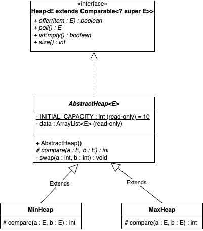
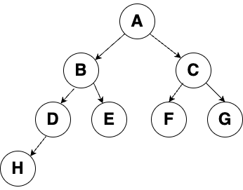

# Homework 12 - Heaps
## Visualization
A heap can be thought of as a ``Binary Tree`` similar to a ``Binary Search Tree``, but where instead of sorting by putting any element less than another element to the left of it, and any element greater than it to the right, the ``Heap`` sorts top to bottom. A ``Heap`` is also always a **Complete Tree**.

## Adding to a Heap
When adding a new element to the ``Heap``, it is placed at the bottom of the ``Heap``. Because the ``Heap`` is always a **Complete Tree**, the bottom is defined as the furthest right node of the lowest level.

Once the element is placed at the bottom of the ``Heap``, it begins to "bubble up" from the bottom by comparing it to its parent. If it is greater than it's parent, the nodes are swapped. and this continues until either the new node is less that its parent or it becomes the root.

## Removing from a Heap
We may only remove from the top of the ``Heap``. When we remove an element (using the ``poll()`` method) we swap the root out and replace it with the item at the bottom of the ``Heap``. We then do the opposite of bubbling up and compare the item to its smallest child. While the item is larger than its smallest child, we swap them and continue until it is not.

## Implementation of a Heap
A ``Heap`` is often implemented as some form of array or list-backed ``PriorityQueue`` that determines the order of the ``Heap``. While the behavior is that of a ``Binary Tree``, it is handled using clever manipulation of the indexes of the backing structure. Our implementation will be an abstract class that implements a ``Heap`` interface. The ``AbstractHeap`` class will have a single unimplemented abstract method: ``compare(E e1, E e2)``, that will be implemented by the extending class and define how the ``Heap`` is organized.

### Heap Interface
* The ``Heap`` will require ``Comparable<? super E>`` for any type stored in the ``Heap`` to ensure the elements can be compared and sorted.
* ``boolean offer(E item``) will add an element to the ``Heap``.
* ``E poll()`` will remove the top element from the ``Heap``.
* ``isEmpty()`` will check if the ``Heap`` is empty
* ``size()`` will return the number of elements still in the ``Heap``.

### AbstractHeap
The ``AbstractHeap`` will use an ``ArrayList`` as its backing structure. When storing elements in the ``Heap``, they are placed in the ``ArrayList`` in such an order that the first index is always the root node, the next two indexes would be the left and right child of the root, the next four indexes would be the children of those nodes, etc. 

Recall that the ``Heap`` is always a **Complete Tree**, so as we add items to the ``Heap``, they would be added at the lowest level from left to right. This allows us to define the parent/child relationship as ``parent = (child - 1) / 2`` with regard to their index locations.

Example: The backing ArrayList has the following values stored:

<table>
    <tr>
        <td>A</td>
        <td>B</td>
        <td>C</td>
        <td>D</td>
        <td>E</td>
        <td>F</td>
        <td>G</td>
        <td>H</td>
    </tr>
</table>

The root node would be **A**, which is at index 0. The left child of **A** would be **B** and the right  child would be **C**. If one were to calculate the parent of **C**, they would take the index of **C** and find that ``(2 - 1) / 2 = 0``. For **H**, which is at index 7, (7 - 1) / 2 = 3, so **D** would be the parent of **H**. The tree representation of the Heap would look like this:

### MinHeap and MaxHeap
These subclasses of ``AbstractHeap`` will implement the abstract ``compare(E a, E b)`` method to define how the ``Heap`` will be sorted. ``MaxHeap`` will sort high to low, so the top of the ``Heap`` will be the largest value. ``MinHeap`` will do the opposite, sorting low to high.
