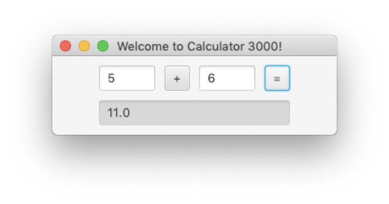
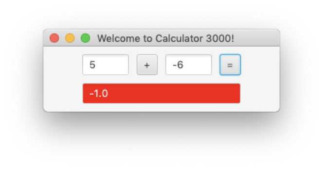

# Homework 2
Using JavaFX, write a simple calculator program that looks something like this:

## Functionality
1. The program will display the result of adding two numbers together when the equals button is clicked.
2. The user cannot modify the answer text field
3. The background color of the result text field is red if the result is negative, otherwise the background should be light grey, as shown above and below.

4. Hitting enter when in either of the operand text fields should also add the numbers together.
5. If either of the operand text fields are empty, nothing should happen.
6. If a non-numeric value is in one of the operand fields, set the answer text field to “Bad input” and set the background color to red

## Formatting
1. For organizing your Scene, try creating an HBox object and put the upper row of components in the HBox, in the order they will appear.
2. Create a VBox object and put the HBox object and the answer TextField in that
3. Use the VBox as the Parent container for your Scene.
4. It will look something like this:
<pre>
HBox innerPane = new HBox();
.
.
.
innerPane.getChildren().addAll(firstOperand, operator, secondOperand, equals);
.
.
.
VBox pane = new VBox();
.
.
.
pane.getChildren().addAll(innerPane, result);
</pre>
5. Play around with the padding and spacing of the VBox and HBox to line it up the way you would like it
6. Below are links to some useful javadoc and tutorial pages

- [VBox](https://openjfx.io/javadoc/21/javafx.graphics/javafx/scene/layout/VBox.html)
- [HBox](https://openjfx.io/javadoc/21/javafx.graphics/javafx/scene/layout/HBox.html)
- [TextField](https://openjfx.io/javadoc/21/javafx.controls/javafx/scene/control/TextField.html)
- [Spacing vs Padding](https://www.vojtechruzicka.com/javafx-layouts-basic/)
