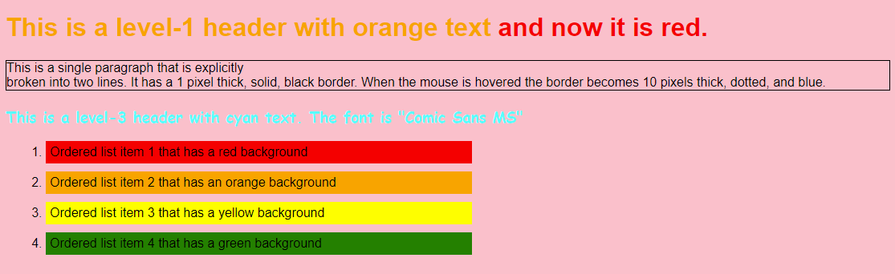
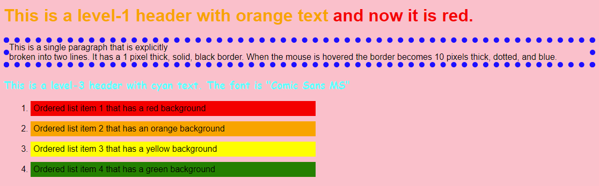

## Introduction

The purpose of this assignment is to introduce you to HyperText Markup Language (HTML) and Cascading Style Sheets (CSS).

For this assignment, may be asked to answer questions, perform research, and/or write code.

- Provide complete answers to all written questions.
- When asked for examples, be specific.
- When asked to perform research, cite your sources.
- Submit your answers in a document separate from code.

Include source files in your submission.  Follow good styling and provide complete documentation (comment blocks, inline comments for complicated code, etc.).

Work on the assignment is to be done with ***your assigned group***.  You are welcome to collaborate with class members, but the submitted assignment must be the work of only your group.

***NOTE:*** You are responsible for being able to perform all material for this assignment.  It may make sense to "divide and conquer" the assignment, but make sure *all* group members understand *all* items in the assignment.

## Background and References

For this assignment you will be using HTML and CSS.  In addition to what was discussed in class the following resources may be helpful:

- HTML Reference from W3Schools: [https://www.w3schools.com/html/default.asp](https://www.w3schools.com/html/default.asp)
- CSS Reference from W3Schools: [https://www.w3schools.com/css/default.asp](https://www.w3schools.com/css/default.asp)
- HTML Validator: [http://validator.w3.org/](http://validator.w3.org/)
- CSS Validator: [http://jigsaw.w3.org/css-validator/](http://jigsaw.w3.org/css-validator/)

## W3Schools Tutorial and Exercises

### HTML Exercises

Complete the following HTML exercise sections and read through their corresponding tutorials from W3Schools [https://www.w3schools.com/html/exercise.asp](https://www.w3schools.com/html/exercise.asp):

- HTML Attributes - https://www.w3schools.com/html/exercise.asp?x=xrcise_attributes1
- HTML Headings - https://www.w3schools.com/html/exercise.asp?x=xrcise_headings1
- HTML Paragraphs - https://www.w3schools.com/html/exercise.asp?x=xrcise_paragraphs1
- HTML Styles - https://www.w3schools.com/html/exercise.asp?x=xrcise_styles1
- HTML Formatting - https://www.w3schools.com/html/exercise.asp?x=xrcise_formatting1
- HTML Quotations - https://www.w3schools.com/html/exercise.asp?x=xrcise_quotation_elements1
- HTML Comments - https://www.w3schools.com/html/exercise.asp?x=xrcise_comments1
- HTML Links - https://www.w3schools.com/html/exercise.asp?x=xrcise_links1
- HTML Images - https://www.w3schools.com/html/exercise.asp?x=xrcise_images1
- HTML Tables - https://www.w3schools.com/html/exercise.asp?x=xrcise_tables1
- HTML Lists - https://www.w3schools.com/html/exercise.asp?x=xrcise_lists1

When you have completed the exercises, create a screen capture, or other method to show proof of completion, and include this in your submission.

### CSS Exercises

Complete the following CSS exercise sections and read through their corresponding tutorials from W3Schools [https://www.w3schools.com/css/exercise.asp](https://www.w3schools.com/css/exercise.asp):

- CSS Selectors - https://www.w3schools.com/css/exercise.asp?x=xrcise_selectors1
- CSS Background Color - https://www.w3schools.com/css/exercise.asp?x=xrcise_background1
- CSS Background Image - https://www.w3schools.com/css/exercise.asp?x=xrcise_background_image1
- CSS Background Repeat - https://www.w3schools.com/css/exercise.asp?x=xrcise_background_repeat1
- CSS Background Attachment - https://www.w3schools.com/css/exercise.asp?x=xrcise_background_attachment1
- CSS Background Shorthand - https://www.w3schools.com/css/exercise.asp?x=xrcise_background_shorthand1
- CSS Text - https://www.w3schools.com/css/exercise.asp?x=xrcise_text1
- CSS Font Family - https://www.w3schools.com/css/exercise.asp?x=xrcise_font1
- CSS Web Safe Fonts - https://www.w3schools.com/css/exercise.asp?x=xrcise_font_websafe1
- CSS Font Style - https://www.w3schools.com/css/exercise.asp?x=xrcise_font_style1
- CSS Font Size - https://www.w3schools.com/css/exercise.asp?x=xrcise_font_size1
- CSS Font Shorthand - https://www.w3schools.com/css/exercise.asp?x=xrcise_font_shorthand1
- CSS Links - https://www.w3schools.com/css/exercise.asp?x=xrcise_link1
- CSS Lists - https://www.w3schools.com/css/exercise.asp?x=xrcise_list1
- CSS Tables - https://www.w3schools.com/css/exercise.asp?x=xrcise_table1
- CSS Combinators - https://www.w3schools.com/css/exercise.asp?x=xrcise_combinators1
- CSS Pseudo-classes - https://www.w3schools.com/css/exercise.asp?x=xrcise_pseudo_classes1
- CSS Pseudo-elements - https://www.w3schools.com/css/exercise.asp?x=xrcise_pseudo_elements1
- CSS Backgrounds - https://www.w3schools.com/css/exercise.asp?x=xrcise_css3_backgrounds1
- CSS Colors - https://www.w3schools.com/css/exercise.asp?x=xrcise_css3_colors1

When you have completed the exercises, create a screen capture, or other method to show proof of completion, and include this in your submission.

## Research and Discovery

### HTML

HTML has evolved since its original creation as a method for marking up documents.  We will cover several HTML tags in class, but won't be able to exhaustively cover all of them.

- Search the list of HTML tags and find **four (4)** (other than the ones covered in class), that you find interesting.  Here are some resources:
  - [https://www.w3schools.com/tags/default.asp](https://www.w3schools.com/tags/default.asp)
  - [https://developer.mozilla.org/en-US/docs/Web/HTML/Element](https://developer.mozilla.org/en-US/docs/Web/HTML/Element)
- For ***EACH*** tag, research the tag and answer the following:
  - What is the tag used for?
  - Name and describe the options (attributes) that the tag supports.
  - Write an example of its use (i.e. an explicit code example of it being used)

***NOTE:*** Make sure to cite your resources for ***EACH*** tag separately - even if using the ones mentioned above.

### CSS

CSS has a history that extends almost as long as HTML ([https://css-tricks.com/look-back-history-css/](https://css-tricks.com/look-back-history-css/)).  It has undergone many additions and features with each version release.  In class, we will cover CSS syntax and some selector, attributes, and features of CSS, but won't be able to exhaustively cover all of them.

- Research the CSS math functions - ```calc```, ```min```, ```max```
  - Describe each in your own words
  - Describe a situation when you'd use each
  - Support your descriptions with a CSS code example for each function
- Search the CSS reference and find **four (4)** selectors, attributes, or other CSS feature (other than the ones covered in class) that you find interesting.  Here are some resources:
  - [https://www.w3schools.com/css/default.asp](https://www.w3schools.com/css/default.asp)
  - [https://developer.mozilla.org/en-US/docs/Web/CSS](https://developer.mozilla.org/en-US/docs/Web/CSS)
- For ***EACH*** feature, research the feature and answer the following:
  - What is the feature used for?
  - Name and describe the values, options, or methods that the feature supports.
  - Write an example of its use (i.e. an explicit code example of it being used).

***NOTE:*** Make sure to cite your resources for ***EACH*** item individually - even if using the ones mentioned above.

### Media Queries

Media queries allow the programmer to set different CSS styles based on device media, in other words what the web application is being displayed on.  For example, a web application can be styled differently if it is being displayed on a screen vs being displayed on paper (printed).

Furthermore, media features can also be queried to adjust the CSS based on how different features of the media or users preferences (screen size, contrast preferences, light or dark mode, etc.).

Research CSS media queries, then answer the following:
- Media Types
  - Describe the media types: ```screen```, and ```print```
  - Describe a situation where you'd want to use the ```print``` media type
- Media Features - Screen Size
  - What media query features is needed to change the CSS styling based on screen width?
  - Describe why you'd want to adjust the CSS based on screen width?
  - Create an example that styles a page differently based on ***three (3)*** different screen widths
- Media Features - Light/Dark Mode
  - What media query features is needed to change the CSS styling the users preferences for light/dark mode?
  - Are there any restrictions for CSS color choices if the user has a dark mode preference?  WHy do you think this is the case?
  - Create an example of a web page that uses different CSS styling based on the users light/dark mode preference.

## Creating a Styled Web Page

Now that you have explored and become familiar with HTML and CSS, use this knowledge to create a web page that fits the structure and formatting from the given screen captures.

The screen captures describe the formatting in the wording of each part.  Specific details of the web page that are not stated in the page itself:

- Unless otherwise stated, the font for the web page must be "Arial"
- The font color unless explicitly stated must be black
- The background color must be pink
- The title of the page must be your name (not the string 'Your Name')
- The ordered list must take up 50% of the page width<br/>
  ***NOTE:*** This is may not be accurately displayed in the screen captures below.  Make sure your submission includes this formatting
- Each ordered list item has a margin of 10 pixels on all sides
- Each ordered list item has a padding of 5 pixels on all sides

### Additional Requirements

- You must create one HTML file containing the structure of the page and at least one separate CSS file containing the formatting.  Do ***NOT*** put CSS styling directly into the HTML file.
- Make sure your HTML passes the [HTML Validator](https://validator.w3.org/) without errors.
- Make sure your CSS passes the [CSS Validator](https://jigsaw.w3.org/css-validator/) without errors.

***NOTE:*** The following two images indicate what the page content should look like.  There are 2 images included:

1. The first image is a display of the page when the mouse is ***NOT*** hovered over the paragraph
2. The second image is a display of the page when the mouse ***IS*** hovered over the bottom paragraph

Page displayed when the mouse is ***NOT*** hovered over the paragraph at the bottom:



Page displayed when the mouse ***IS*** hovered over the paragraph at the bottom:



### Getting Started

The following files have been provided for you in your repository:

- [src/index.html](src/index.html) - HTML file to contain the structure for the "Creating a Styled Web Page"
- [src/style.css](src/style.css) - CSS file to contain the style of the "Creating a Styled Web Page"

At the top of ***EACH SOURCE FILE*** include a comment block with your name, assignment name, and section number.

## Vibe With Me

Vibe coding ([https://www.merriam-webster.com/slang/vibe-coding/](https://www.merriam-webster.com/slang/vibe-coding/)) is the process of using an AI to assist in code creation.  Large language model tools such as Claude, GPT, and others have become increasingly sophisticated and able to perform all sorts of coding tasks, especially in the world of website creation.

Choose a large language model (there are several) and use it to assist in creating a web page the utilizes the HTML and the CSS features that you researched earlier.  Have it also generate media queries to create an appropriate light mode and dark mode.

Include the generated code in your submission along with a file that answers the following:

- What is the name (and who is the creator) of the language model that you used?
- Critique the code, what problems do you see with what was generated?  Are there any bugs?  If so, how would you fix them?
- What sorts of refinements can be done to your prompts to help the language model create a better looking site with fewer bugs?
- What are the exact prompts (including your revisions) that you used to create the website?

### Vibe The Page

Can you vibe code the page you create in the "Creating a Styled Web Page" section?  Try it, and include the vibed version (or as close as you were able to get) in you submission along with the prompt (or prompts) that you used.

## Deliverables

When you are ready to submit your assignment prepare your repository:

- Make sure your name(s), assignment name, and section number are in comments on ALL submitted files.
- Make sure you have completed all activities and answered all questions.
- Make sure you cite your sources for all research.
- Make sure your assignment code is commented thoroughly.
- Include in your submission, a set of suggestions for improvement and/or what you enjoyed about this assignment.
- Make sure all files are committed and pushed to the main branch of your repository.

***NOTE***: Do not forget to 'add', 'commit', and 'push' all new files and changes to your repository before submitting.

To submit, copy the URL for your repository and submit the link to Canvas.

### Additional Submission Notes

If/when using resources from material outside what was presented in class (e.g., Google search, Stack Overflow, etc.) document the resource used in your submission.  Include exact URLs for web pages where appropriate.

***NOTE:*** Sources that are not original research and/or unreliable sources are not to be used.  For example:

- Wikipedia is not a reliable source, nor does it present original research: [https://en.wikipedia.org/wiki/Wikipedia:Wikipedia_is_not_a_reliable_source](https://en.wikipedia.org/wiki/Wikipedia:Wikipedia_is_not_a_reliable_source)
- Large language models are not reliable sources: [https://stackoverflow.blog/2025/06/30/reliability-for-unreliable-llms/](https://stackoverflow.blog/2025/06/30/reliability-for-unreliable-llms/)

***NOTE:*** Except for "Vibe With Me", large language models should not be used for any part of this assignment.

For more information, please see the [MSOE CS Code of Conduct](https://msoe.s3.amazonaws.com/files/resources/swecsc-computing-code-of-conduct.pdf).

## Grading Criteria

- (5 Points) Submitted files follow submission guidelines
  - Only the requested files were submitted
  - Files are contain name, assignment, section
  - Sources outside of course material are cited
- (5 Points) Suggestions
  - List of suggestions for improvement and/or what you enjoyed about this assignment
- (10 Points) HTML W3Schools Exercises
- (10 Points) CSS W3Schools Exercises
- (10 Points) HTML Tag Research
- (10 Points) CSS Research
- (10 Points) Media Query Research
- (25 Points) Create a Styled Web page
  - (10 Points) Code Structure
    - Readable code/file structure
    - Code is well documented
    - Code passes the HTML validator without errors
    - Code passes the CSS validator without errors
    - HTML only contains structure - no logic code or styling
  - (15 Points) Structure and Styling 
    - Webpage is structured and styled according to the requirements defined
- (15 Points) Vibe With Me