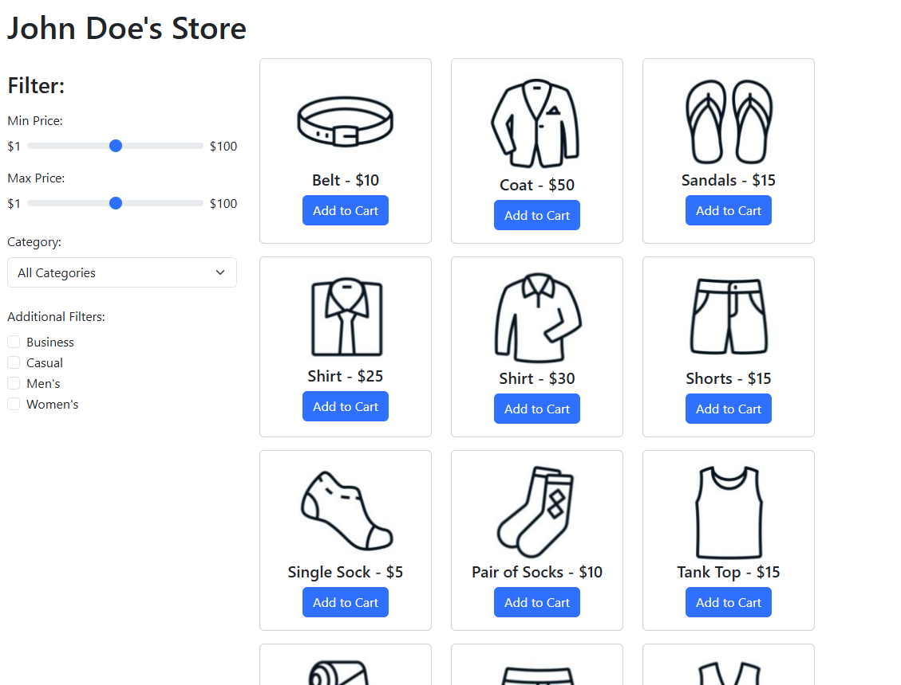
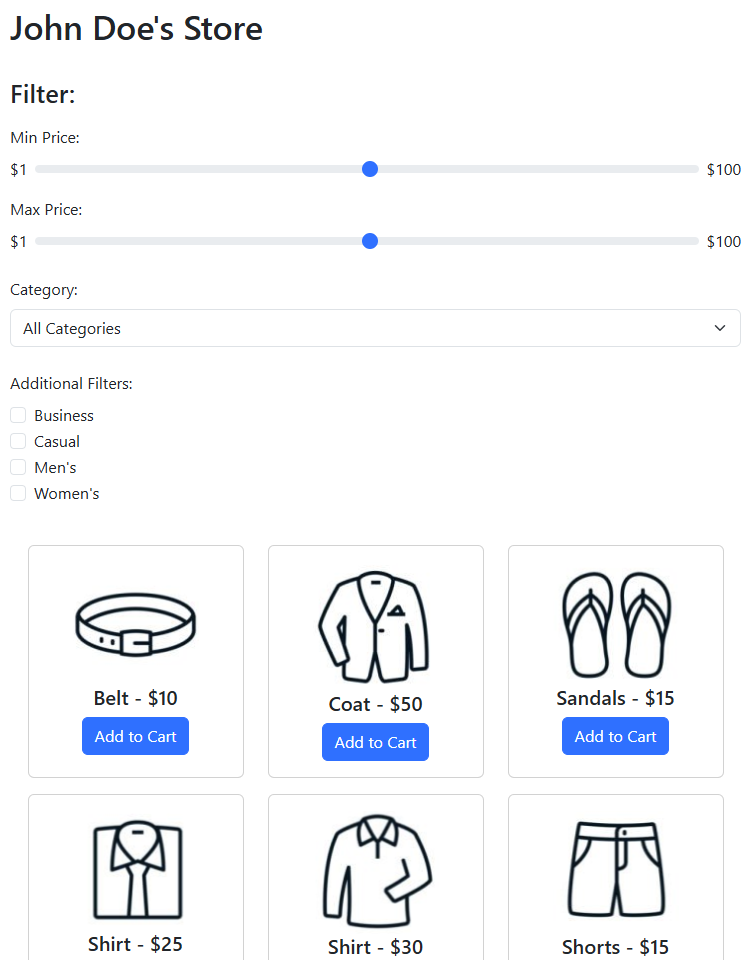

## Introduction

The purpose of this assignment is to introduce you to the styling libraries, specifically Bootstrap but also other styling libraries that exist on the internet.

For this assignment, you may be asked to answer questions, perform research, and/or write code.

- Provide complete answers to all written questions.
- When asked for examples, be specific.
- When asked to perform research, cite your sources.
- Submit your answers in a document separate from code.

Include source files in your submission.  Follow good styling and provide complete documentation (comment blocks, inline comments for complicated code, etc.).

Work on the assignment is to be done with ***your assigned group***.  You are welcome to collaborate with class members, but the submitted assignment must be the work of only your group.

***NOTE:*** You are responsible for being able to perform all material for this assignment.  It may make sense to "divide and conquer" the assignment, but make sure *all* group members understand *all* items in the assignment.

## Background and References

While writing our own CSS style for all elements in our web applications can be fun and allows us to put our own 'mark' on our art work.  Each individual CSS statement and styling can get rather tedious.  As such, developers have created styling libraries that consist of CSS and/or JavaScript to create styling along with 'Components' with behaviors beyond what is provided through HTML structure alone.

Bootstrap is web application toolkit for creating 'responsive' web pages.  It consists of:

- CSS for styling elements including fonts, spacing, colors, etc. though CSS classes
- Components - elements created through CSS and JavaScript to provide user interface items beyond what is available in HTML
- Utilities - CSS classes and JavaScript functions for managing layout, validation, animation, among others.

The full documentation for Bootstrap can be found on their website: [https://getbootstrap.com/](https://getbootstrap.com/).

In this activity you will experiment with different components and formatting options available in the Bootstrap library along with another of your choice.

## Content Delivery Networks

Content delivery networks (CDN)s can be a useful tool for web developers as it allows the deployed web application to be small and not include copies of third party libraries.  However, when using anything directly from the web (via an external link/url) raises security concerns.

- Research CDNs from a general sense.  What are some (at least 2) security concerns that you have in regard to using CDNs?
- Research the ```link``` and ```script``` HTML tags
  - Describe the ```integrity``` attribute and the ```crossorigin``` attribute used to include the Bootstrap library via CDN.
  - What security concern(s) to these attributes attempt to fix?  Explain how this works.

## Responsive Design

Responsive design (https://developer.mozilla.org/en-US/docs/Learn_web_development/Core/CSS_layout/Responsive_Design) is a user experience practice for user interfaces to "flow" well regardless of screen size.  For example, computer screen, table screen, and phone screen all have different widths (especially when considering rotation of the screen).  With responsive design a website changes depending on how wide the screen is.  CSS already has different media queries built in for different screen sizes.

- Research responsive design (site your sources) to become more familiar with the design principles
- Describe 3 different design principles related to responsive design.

## Bootstrap - Installation and Setup

The Bootstrap library can either be used by direct download or imported via a content delivery network (CDN).

Importing from a CDN requires adding a couple lines to our HTML header.  The following HTML imports the Bootstrap CDN.

```html
<!DOCTYPE html>
<html lang="en">
    <head>
        <meta charset="UTF-8">
        <title>Bootstrap Exercise</title>

        <!-- Include the Bootstrap library -->
        <link href="https://cdn.jsdelivr.net/npm/bootstrap@5.3.8/dist/css/bootstrap.min.css" rel="stylesheet" integrity="sha384-sRIl4kxILFvY47J16cr9ZwB07vP4J8+LH7qKQnuqkuIAvNWLzeN8tE5YBujZqJLB" crossorigin="anonymous">
        <script src="https://cdn.jsdelivr.net/npm/bootstrap@5.3.8/dist/js/bootstrap.bundle.min.js" integrity="sha384-FKyoEForCGlyvwx9Hj09JcYn3nv7wiPVlz7YYwJrWVcXK/BmnVDxM+D2scQbITxI" crossorigin="anonymous"></script>
        </body>
    </head>
</html>
```

Bootstrap consists of two files so make sure you have them both listed:

- Bootstrap CSS - styling for the Bootstrap components
- Bootstrap JavaScript - code to manage the behavior of the components

## W3Schools Tutorial and Exercises

Complete the following Bootstrap exercise sections and read through their corresponding tutorials from W3Schools [https://www.w3schools.com/bootstrap5/exercise.php](https://www.w3schools.com/bootstrap5/exercise.php):

- BS5 Typography
- BS5 Tables
- BS5 Buttons
- BS5 Dropdowns
- BS5 List Groups
- BS5 Cards

Create a screen capture showing that you have completed the W3Schools exercises.  Include this screen capture in your submission.

When you have completed the exercises, read through the W3Schools tutorials on Bootstrap forms: [https://www.w3schools.com/bootstrap5/bootstrap_forms.php](https://www.w3schools.com/bootstrap5/bootstrap_forms.php).

Make sure you read through all the subsections:

- BS5 Forms
- BS5 Select Menus
- BS5 Checks and Radios
- BS5 Range
- BS5 Input Groups
- BS5 Floating Labels
- BS5 Form Validation

When you have completed the Boostrap forms tutorials, read through the Bootstrap Container and Grid documentation to familiarize yourself with the Bootstrap container and grid system.

- Bootstrap Container
  - https://www.w3schools.com/bootstrap5/bootstrap_containers.php
  - https://getbootstrap.com/docs/5.3/layout/containers/
- Bootstrap Grid
  - https://www.w3schools.com/bootstrap5/bootstrap_grid_basic.php
  - https://getbootstrap.com/docs/5.3/layout/grid/

## Creating a Bootstrap E-commerce Site

Using the information you learned from the Bootstrap tutorials and exercises, create a static web page that utilizes Bootstrap styling classes.  You web page must be a representation of an e-commerce site.  Your web page must consist of the following at minimum:

- A menu on the left with menu items allowing the user to filter items.  Your filter must include at a minimum:
  - A slider to filter by price
  - A dropdown to select a category filter (the categories are your choice)
  - At least 3 different checkbox filters (the values of the checkboxes are your choice)
- A display on the main section of the page for displaying items in rows and columns (like a grid).  Your item display must consist of at least 10 different items to purchase.
  - Items must be bordered in a Card or similar looking display
  - The item must consist of a picture, the item name, text indicating the price, and a button to "add to cart"
- A header on that displays the name of the e-commerce site - the exact name is up to you
- A footer that is at the very bottom of the browser window
  - The footer is always at the bottom, even if the main content of the page is small
  - The footer scrolls off the page if the page is tall enough to require a scrollbar.
- Your page must utilize 5 different types of typography
- Your page must utilize 2 different sizes of padding and 2 different sizes of margins

***NOTE:*** you do ***NOT*** need to implement the behavior of the web application.  Only the structure (HTML) and styling (CSS and classes) are required.

Your page must utilize responsive design.  In other words, the page must look well on a variety of different screen sizes.  The idea of responsive design is already built into the Bootstrap grid system.  Bootstrap utilizes CSS media queries of varying screen sizes using breakpoints - https://getbootstrap.com/docs/5.3/layout/breakpoints/#available-breakpoints.

For example, a site when displayed on a wide screen might look like this:


But when displayed on a skinny screen might look like this:


Using your knowledge of media queries, add additional CSS to support different screen sizes.  You ***must*** use CSS to adjust at least **2** of the following:

- Margins and/or padding
- Font sizes
- Element width
- Element screen location
- Number of columns in your main display grid.

Use the Boostrap breakpoints to select the screen sizes.

Additional styling and components are up to you.  If you add additional styling and/or components, document what you add in a separate file or in a comment block at the top of the HTML file.

Include your HTML and CSS files in your submission.

### Getting Started

The following files have been provided for you in your repository:

- [src/bootstrap.html](src/bootstrap.html) - HTML file to contain the structure for the web page
- [src/styles.css](src/styles.css) - CSS file to contain additional responsive styling

At the top of ***EACH SOURCE FILE*** include a comment block with your name, assignment name, and section number.

## Other Styling Libraries

While Bootstrap is arguably one of the more popular styling and component libraries on the web, there are others that are building in popularity.  Here are some:

- Tailwind - [https://tailwindcss.com/](https://tailwindcss.com/)
- Animate.css - [https://animate.style/](https://animate.style/)
- Semantic UI - [https://semantic-ui.com/](https://semantic-ui.com/)
- Skeleton - [http://getskeleton.com/](http://getskeleton.com/)
- Milligram - [https://milligram.io/](https://milligram.io/)

Research CSS styling libraries and find one that interests you

- Describe how to install the library (CDN or direct download)
  - NOTE: several third party libraries utilize a tool called ```npm``` (the Node.js Package Manager).  We will learn about that later in the term.
  - For now, use only CDN or direct download
- Research and learn about the components and/or other styling the library provides
  - Find *5* separate components that you find interesting and describe how to use them the library you chose
  - Create a web application (HTML, CSS, and anything else needed by the library) that uses all *5* components

Include your research, descriptions, and created web application in your submission.

## Vibe With Me

Vibe coding ([https://www.merriam-webster.com/slang/vibe-coding/](https://www.merriam-webster.com/slang/vibe-coding/)) is the process of using an AI to assist in code creation.  Large language model tools such as Claude, GPT, and others have become increasingly sophisticated and able to perform all sorts of coding tasks, especially in the world of website creation.

Choose a large language model (there are several) and use it to assist creating a website that uses the styling library that you researched.   Consider the following in your prompt to the language model:

- Make sure the resulting website uses responsive design and looks user-friendly on different screen sizes.
- Consider adding form elements with input validation.

Include the generated code in your submission along with a file that answers the following:

- What is the name (and who is the creator) of the language model that you used?
- Critique the code, what problems do you see with what was generated?  Are there any bugs?  If so, how would you fix them?
- Run the generated page through the HTML and CSS validator
    - What mistakes did the model make?
    - What can be done to fix them?
    - What sorts of refinements can be done to your prompts to help the language model create a better looking site with fewer bugs?
- What are the exact prompts (including your revisions) that you used to create your code?

## Deliverables

When you are ready to submit your assignment prepare your repository:

- Make sure your name, assignment name, and section number are in comments on ALL submitted files.
- Make sure you have completed all activities and answered all questions.
- Make sure you cite your sources.
- Make sure your assignment code is commented thoroughly.
- Include in your submission, a set of suggestions for improvement and/or what you enjoyed about this assignment.
- Make sure all files are committed and pushed to the main branch of your repository.

***NOTE***: Do not forget to 'add', 'commit', and 'push' all new files and changes to your repository before submitting.

To submit, copy the URL for your repository and submit the link to Canvas.

### Additional Submission Notes

If/when using resources from material outside what was presented in class (e.g., Google search, Stack Overflow, etc.) document the resource used in your submission.  Include exact URLs for web pages where appropriate.

***NOTE:*** Sources that are not original research and/or unreliable sources are not to be used.  For example:

- Wikipedia is not a reliable source, nor does it present original research: [https://en.wikipedia.org/wiki/Wikipedia:Wikipedia_is_not_a_reliable_source](https://en.wikipedia.org/wiki/Wikipedia:Wikipedia_is_not_a_reliable_source)
- Large language models are not reliable sources: [https://stackoverflow.blog/2025/06/30/reliability-for-unreliable-llms/](https://stackoverflow.blog/2025/06/30/reliability-for-unreliable-llms/)

***NOTE:*** Except for "Vibe With Me", large language models should not be used for any part of this assignment.

For more information, please see the [MSOE CS Code of Conduct](https://msoe.s3.amazonaws.com/files/resources/swecsc-computing-code-of-conduct.pdf).

## Grading Criteria

- (5 Points) Submitted files follow submission guidelines
  - Submitted files follow submission guidelines
  - Files are contain name, assignment, section
  - Sources outside of course material are cited
  - Readable code/file structure
  - Code is well documented
  - Code passes the HTML validator without errors
  - Code passes the CSS validator without errors
  - HTML contains only structure - no logic code or styling
- (5 Points) Suggestions
  - List of suggestions for improvement and/or what you enjoyed about this assignment
- (10 Points) Content Delivery Networks
- (10 Points) Responsive Design
- (10 Points) Bootstrap W3Schools Exercises
- (20 Points) Creating a Bootstrap E-commerce Site
- (20 Points) Other Styling Libraries
- (20 Points) Vibe With Me
